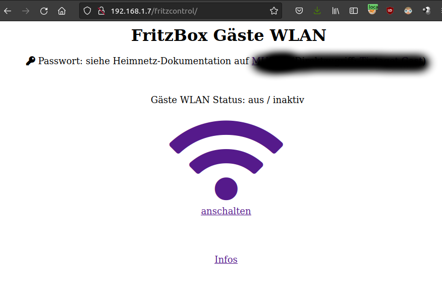

# FritzBox Guest Wifi Control

Web-App (FastAPI) to control the Fritz!Box guest WiFi, i.e., turn it on/off.

## Requirements

* Python 3.8+
    * pipenv, install with `python3 -m pip install --user pipenv`
* Fritz!Box
    * API user, create in FritzBox settings

## How-To Run

1. `pipenv sync`
2. `cp env.template .env` and adjust (FritzBox IP and credentials)
3. `pipenv run start`
4. http://localhost:5000/



## Nginx Reverse Proxy

```
location /fritzcontrol/ {
		proxy_pass http://127.0.0.1:5000/;
		include /etc/nginx/proxy_params;
}
```
